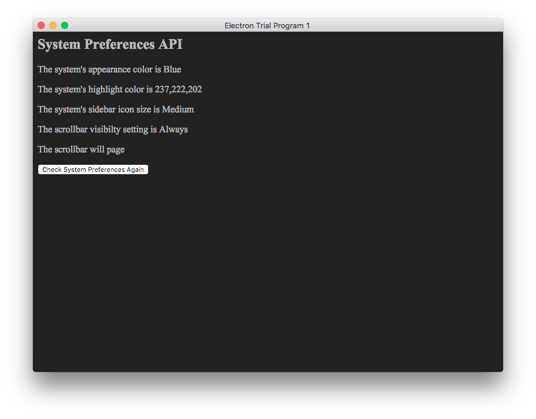

# node-osx-prefs 
> Node API for some of OSX System Preferences

## Installation

```sh
$ npm install --save node-osx-prefs
```

## Usage

```js
var nodeOsxPrefs = require('node-osx-prefs');

nodeOsxPrefs.isDarkMode(); 
nodeOsxPrefs.getAppearanceColor();
nodeOsxPrefs.getHighlightColor();
nodeOsxPrefs.getSidebarIconSize();
nodeOsxPrefs.getScrollbarVisibility();
nodeOsxPrefs.isScrollbarPaging();

```

## API

### isDarkMode()

Returns a boolean value; true if the system is in dark mode, false if the system is not in dark mode.

### getAppearanceColor()

Returns a string value, 'Blue' if the system appearance color is blue, 'Graphite' if the system appearance color is graphite.

### getHighlightColor()

Returns an array of three integers between 0 and 255 corresponding to the RGB values of the system's highlight color.

### getSidebarIconSize()

Returns a string value, either 'Small', 'Medium' or 'Large'.

### getScrollbarVisibility()

Returns a string value, either 'Automatic', 'Always' or 'WhenScrolling' depending on the user's system preference.

### isScrollbarPaging()

Returns a boolean value, true if the clicking the scrollbar is meant to go to the next page, false if clicking the scrollbar is meant to skip to that section.

## Building

Building the library:

```sh
$ npm install
```

## Electron Demo/Test App

Building and running the electron test app:

```sh
$ cd electron-test
$ npm install
```

```sh
$ npm run start
```

Here are some screenshots of what the application looks like.  Whether dark mode is enabled is the only setting that affects the appearance here, the other settings are just listed.

If dark mode is enabled:



If dark mode is not enabled:


## License

MIT © [Dylan Cooper]()

